# Online Book Review Application

This repository contains the server-side implementation of an Online Book Review application, developed using Node.js and Express.js. This project demonstrates the practical application of back-end development skills, focusing on RESTful APIs, CRUD operations, authentication, and asynchronous programming.

## Table of Contents
- [Overview](#overview)
- [Features](#features)
- [Technologies Used](#technologies-used)
- [Tasks and Implementation](#tasks-and-implementation)
- [Course Certificate](#project-certificate)

## Overview
The Online Book Review application is designed to manage book reviews for an online bookstore. It provides a RESTful API for managing books and reviews, allowing multiple users to interact with the system simultaneously. Authentication ensures that only authorized users can perform certain operations, such as adding, editing, or deleting reviews.

## Features
1. Retrieve a list of all books in the bookstore.
2. Search books by ISBN, author names, or titles.
3. Retrieve reviews for specific books.
4. User registration and login.
5. Add, modify, and delete book reviews (logged-in users only).
6. Concurrent user interactions using asynchronous programming.

## Technologies Used
- **Node.js**: JavaScript runtime for server-side programming.
- **Express.js**: Web framework for building RESTful APIs.
- **JWT (JSON Web Tokens)**: For user authentication and authorization.
- **Session Authentication**: To manage user sessions securely.
- **Axios**: For HTTP requests.
- **Postman**: For API testing.
- **Async/Await and Promises**: To handle asynchronous operations.

## Tasks and Implementation
1. Task 1: Get the book list available in the shop.
   
   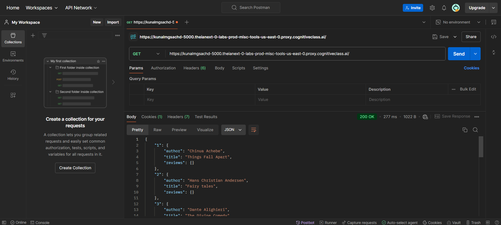

2. Task 2: Get the books based on ISBN.
   
   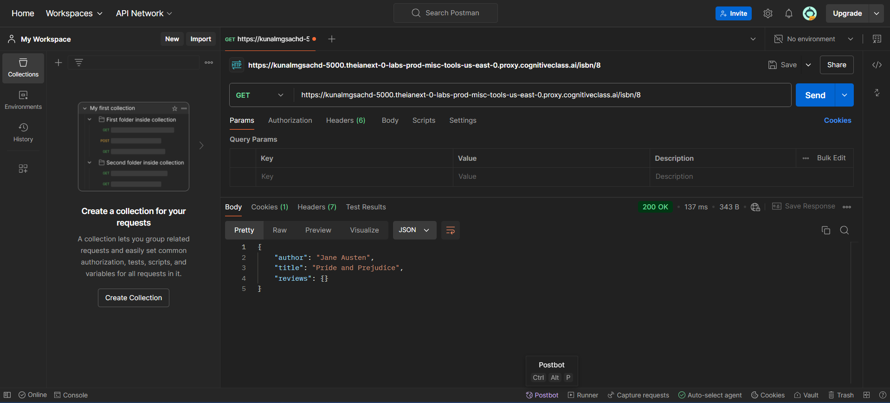

3. Task 3: Get all books by the author.
   
   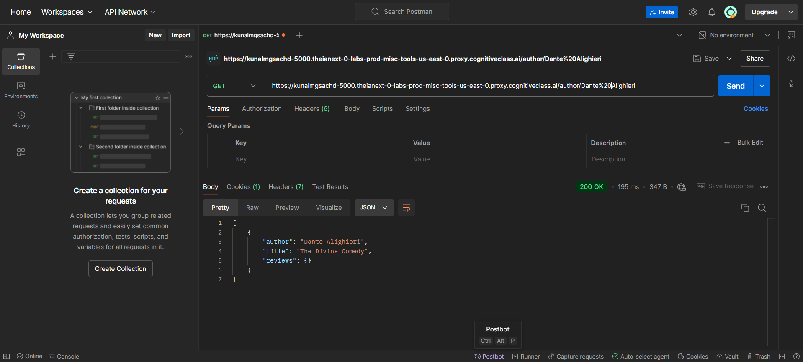

4. Task 4: Get all books based on title.
   
   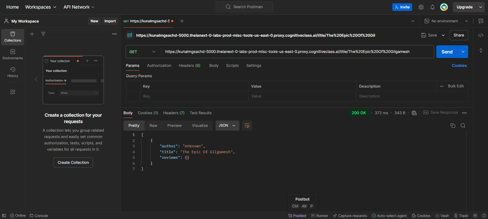

5. Task 5: Get a book review.
   
   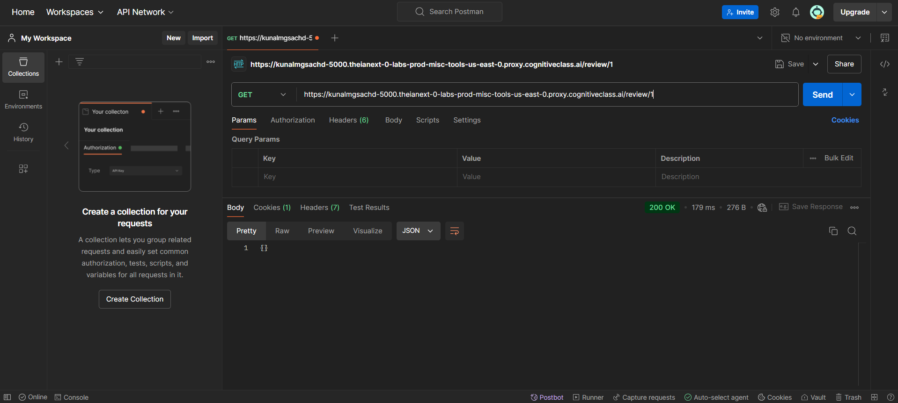

6. Task 6: Register new user.
   
   

7. Task 7: Login as a registered user.
   
   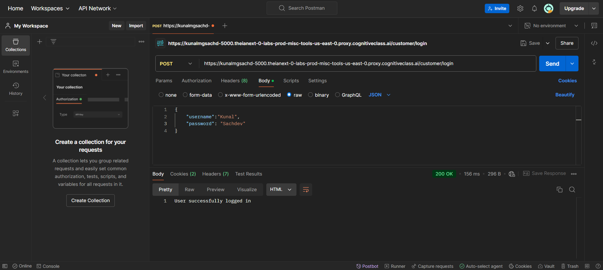

8. Task 8: Add/modify a book review.
   
   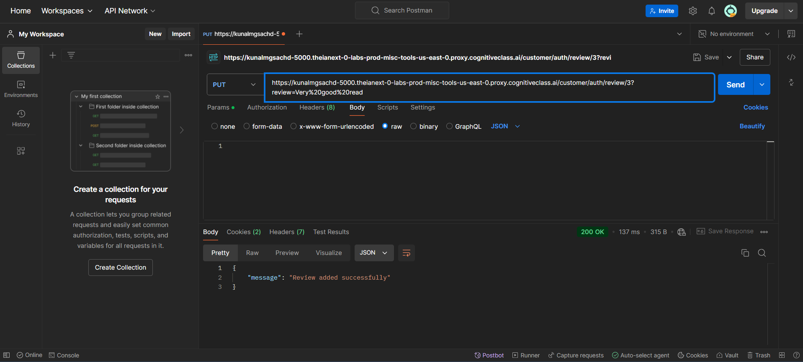

9. Task 9: Delete the book review that was earlier added by that particular user.
   
   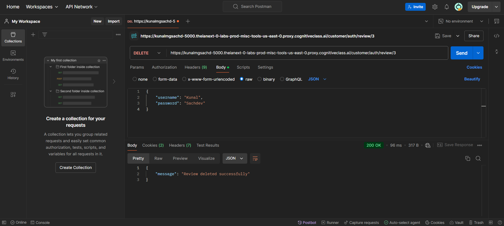

10. Task 10: Get all books using an async callback function.
    
    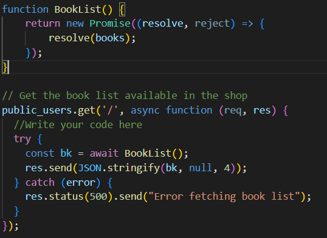

11. Task 11: Search by ISBN using Promises.
    
    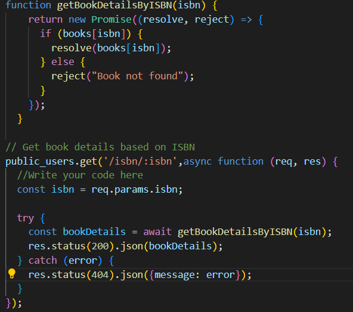

12. Task 12: Search by Author.
    
    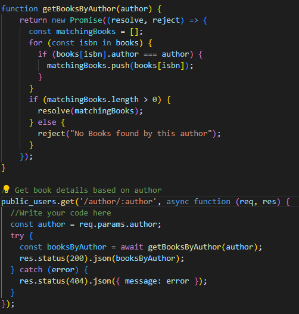

13. Task 13: Search by Title.
    
    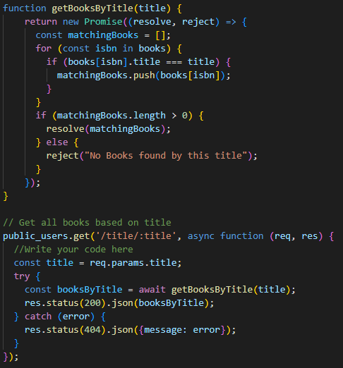

## Course Certificate
You can view the course certificate [here](https://github.com/KunalSachdev2005/expressBookReviews/blob/main/Developing_Back-end_Apps_with_Node_JS_%26_Express_Certificate.pdf).

